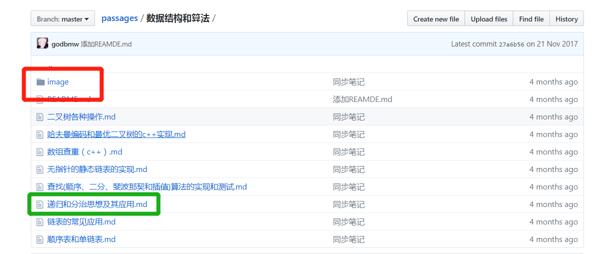
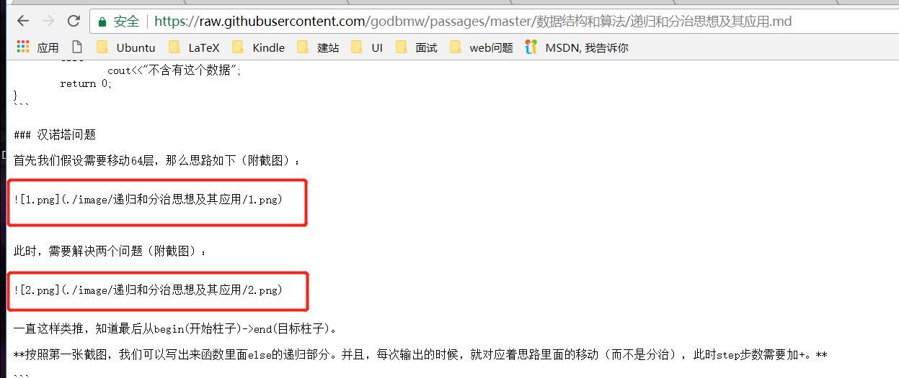

# 常见问题

在这里你可以找到一些常见问题的解答。

## `markdown`中插入图片链接

 
如果你的图片是利用**相对路径**插入（即：图片和文章放在一个仓库里），那么：**请在存放文章的文件夹下创建对应文件夹，并且将图片存入其中**。 

1. 例如，你可以在存放文章的文件下建立`image`文件夹，如下图所示：
 

2. 在对应的文章里（例如上图标出的`递归和分治思想及其应用.md`），利用相对路径来索引图片。 

3. 当然，放置图片的文件夹还可以命名为`images`、`photo`等。只要是在**存放文章的目录下**即可。 

